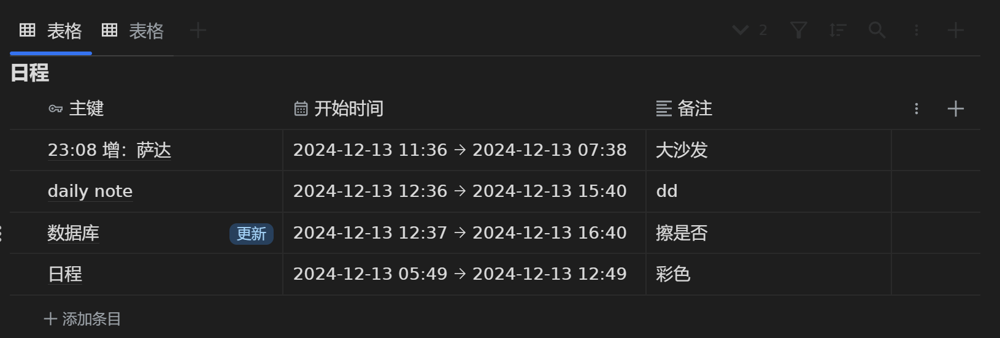
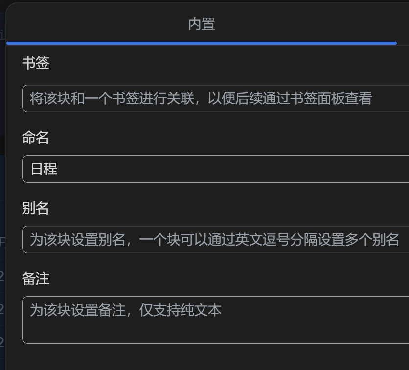
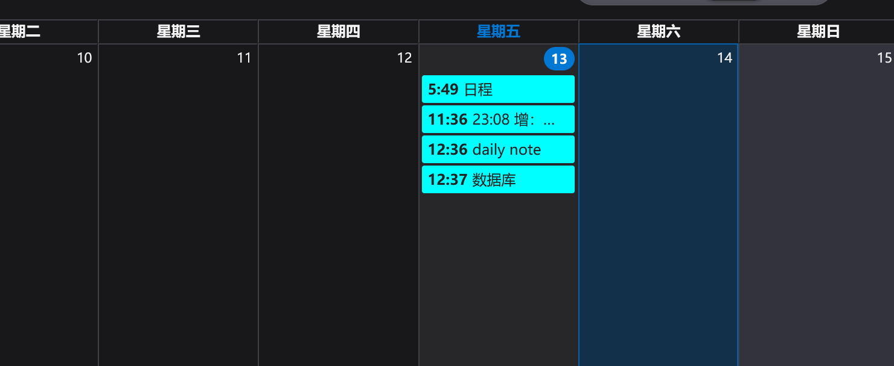

自用插件，测试预览，目前不建议使用，因为使用方式还达不到优雅的程度

第一个工具：生成日历文件
目前使用方式：
添加一个数据库（前三列格式如图）

再给此数据库添加命名属性，内容为“日程” （如图）

最后点击右上角的
中的
即可生成日历文件

文件链接为：https://example.com/public/stevetools/calendar.ics（改为自己的域名）

使用thunderbird订阅的效果如下

小米日历也支持订阅此日历文件
